# Application Tracking System – Take-Home Assignment

<br>
This project is my submission for the Welcome to the Jungle Full Stack take home test.

---

### Table of Contents

- [Application Tracking System – Take-Home Assignment](#application-tracking-system--take-home-assignment)
- [Scope & Approach](#scope--approach)
- [Reflection](#reflection)
- [Planning & Design Process](#planning--design-process)
  - [User Journey Wireframes](#user-journey-wireframes)
    - [Non-Authenticated User Journey](#non-authenticated-user-journey)
    - [Authenticated User Journey](#authenticated-user-journey)
- [Backend Implementation](#backend-implementation)
  - [Features Implemented](#features-implemented)
  - [Bug Fixes](#bug-fixes)
  - [Additional Backend Improvements](#additional-backend-improvements)
- [Frontend Implementation](#frontend-implementation)
  - [Core Features](#core-features)
  - [Authentication Aware UI](#authentication-aware-ui)
  - [UI/UX](#uiux)
  - [Testing Coverage](#testing-coverage)
  - [Frontend Bug Fix](#frontend-bug-fix)
- [Application Screenshots](#application-screenshots)
- [Design & Architecture Decisions](#design--architecture-decisions)
  - [Architecture](#architecture)
  - [Component Reusability](#component-reusability)
  - [State Management](#state-management)
- [What I'd Add With More Time](#what-id-add-with-more-time)
- [Running the Project](#running-the-project)
  - [Backend](#backend)
  - [Frontend](#frontend)
  - [Tests](#tests)
- [Conclusion](#conclusion)

---

## Scope & Approach

Given the timeframe, I focused on delivering production quality features across the full stack:

- **Backend**: 3 features + 3 bug fixes with comprehensive testing
- **Frontend**: Complete job management UI with authentication-aware features
- **Testing**: 6 component test suites covering critical user flows

This allowed me to demonstrate both breadth (multiple features) and depth (implementation).

---

## Reflection

This was my first time working with Elixir(/Phoenix), and I genuinely enjoyed the learning curve. The pattern matching and data transformations felt really intuitive once I got the hang of them.

On the frontend, Welcome UI turned out to be simple to use. I did run into a few walls where some nice (dare I say **_nicer_**) components I wanted to use were part of v10, and trying to update from v9 broke the original codebase. Given the time constraints, I didn't want to overcomplicate things, so I stuck with v9 and made sure to carefully check the documentation to avoid using any v10 features or changes.

The backend was obviously completely new territory for me. I spent my evenings going through the Phoenix and Ecto documentation provided in the task, and initially just focused on the minimum requirement of 1 backend feature and 1 bug fix. But with some spare time left, I decided to challenge myself and tackle all the bugs and features. I think it turned out pretty well!

The most challenging aspect was definitely foreign key constraints. Understanding Ecto's migration system and the different `on_delete` strategies required a lot of trial-and-error, but getting that success moment when it finally clicked was really satisfying. Using the Ecto.Multi pattern for handling transactions made complex operations like the application + notification flow much easier.

---

## Planning & Design Process

Before diving in, I sketched out wireframes to map user journeys and plan the architecture. This helped me visualise the flow between different states and ensure a consistent user experience across authenticated and non-authenticated views.

Here, I incorporated the welcome-ui to understand what components were important to utilise.

### User Journey Wireframes

**Non-Authenticated User Journey**

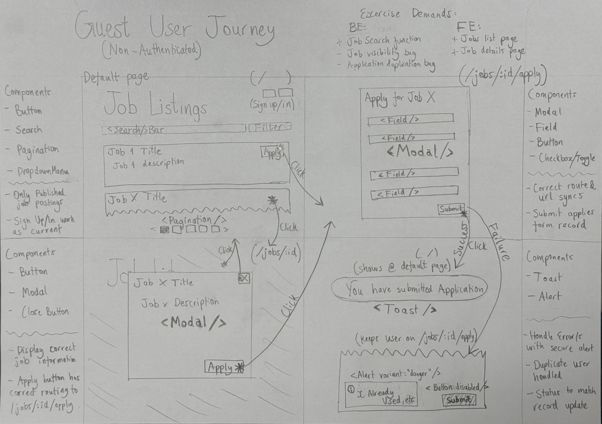

Users can browse published jobs, view details, and submit applications through a streamlined modal flow.

**Authenticated User Journey**


Authenticated users have full CRUD capabilities, with additional views for managing applications and tracking job modifications.

---

## Backend Implementation

### Features Implemented

| Feature                       | Description                                            | Implementation                                                                         |
| ----------------------------- | ------------------------------------------------------ | -------------------------------------------------------------------------------------- |
| **Job Search**                | Search jobs by title, office, work_mode, contract_type | Query parameter filtering. Case-insensitive. Supports multiple combinations            |
| **Modification Log**          | Track all job edits with user attribution              | Created `job_modifications` table to log field changes. Displays who, when and what    |
| **Application Notifications** | Email notification on new applications                 | Mock email system logs notifications to console Tracks job creator via `user_id` field |

### Bug Fixes

| Bug                        | Problem                                                            | Solution                                                                                                                          |
| -------------------------- | ------------------------------------------------------------------ | --------------------------------------------------------------------------------------------------------------------------------- |
| **Job Visibility**         | All jobs visible to public users regardless of status              | Implemented `list_published_jobs/0` function filtering by `:published` status. Authenticated users see all jobs via `list_jobs/0` |
| **Delete with Applicants** | Cannot delete jobs with applications due to foreign key constraint | Changed `applicants.job_id` constraint from `on_delete: :nothing` to `on_delete: :delete_all` via migration.                      |
| **Duplicate Applications** | Users can apply multiple times with same email/phone               | Added application-level check in `apply_controller.ex` to query existing applications by email OR phone before creating new ones  |

### Additional Backend Improvements

| Enhancement                   | Rationale                                                                                        |
| ----------------------------- | ------------------------------------------------------------------------------------------------ |
| **User attribution for jobs** | Added `user_id` to jobs table to track ownership for notifications and future features           |
| **Cascade delete support**    | Modified foreign key constraints to allow job deletion even with applicants                      |
| **Contract type formatting**  | Added helper function to return human-readable labels (e.g., "Full-Time" instead of "FULL_TIME") |

---

## Frontend Implementation

### Core Features

| View                | Route             | Description                                  | Auth Required |
| ------------------- | ----------------- | -------------------------------------------- | ------------- |
| **Job Listings**    | `/`               | Searchable job list with real-time filtering | No            |
| **Job Details**     | `/jobs/:id`       | Full job information with Apply button       | No            |
| **Job Application** | `/jobs/:id/apply` | Application form with validation             | No            |
| **Job Creation**    | `/jobs/new`       | Create new job postings                      | Yes           |
| **Job Editing**     | `/jobs/:id/edit`  | Edit existing jobs with prefilled data       | Yes           |

### Authentication Aware UI

| Feature                 | Description                                                   |
| ----------------------- | ------------------------------------------------------------- |
| **Conditional Actions** | Apply button for guests, Edit button for authenticated users  |
| **Applications Table**  | View all applicants with contact actions (email/phone)        |
| **Change History**      | Accordion showing modification log with popover details       |
| **Dynamic Content**     | Authenticated users see draft jobs; guests see published only |

### UI/UX

| Enhancement                      | Implementation                                                                                         |
| -------------------------------- | ------------------------------------------------------------------------------------------------------ |
| **Modal-based Navigation**       | All job interactions (view/apply/create/edit) use modals instead of full page navigation for better UX |
| **Real-time Search**             | Instant client-side filtering by job title and office location                                         |
| **Contract Type Formatting**     | Display human-readable labels throughout UI                                                            |
| **Modification Details Popover** | Click "View Edits" to see before/after values in a styled popover                                      |
| **Hidden Scrollbars**            | Clean modal appearance with custom CSS                                                                 |
| **Responsive Tables**            | Applications and modifications display cleanly in Welcome UI tables                                    |

### Testing Coverage

| Component             | Tests                                            | Coverage |
| --------------------- | ------------------------------------------------ | -------- |
| **SearchBar**         | Input rendering, value display, onChange handler | 3 tests  |
| **JobDetailModal**    | Data fetching, button rendering, auth state      | 4 tests  |
| **JobCreationModal**  | Form fields, validation, submit flow             | 5 tests  |
| **JobApplyModal**     | Form rendering, required fields                  | 4 tests  |
| **JobEditModal**      | Prefill data, save/delete actions                | 4 tests  |
| **ApplicationsTable** | Empty state, data display, contact buttons       | 5 tests  |

**Total: 6 test suites, 25 tests, all passing**

### Frontend Bug Fix

| Bug                       | Issue                                                                  | Solution                                                                                                           |
| ------------------------- | ---------------------------------------------------------------------- | ------------------------------------------------------------------------------------------------------------------ |
| **TypeScript Type Error** | `SearchBarProps` interface used incorrect type for `onChange` callback | Changed from `(value: string) => void` to proper event handler type, ensuring type safety across search components |

---

## Application Screenshots

The final implementation brings the wireframes to life with a clean, modal based interface:

<table>
<tr>
<td width="33%">

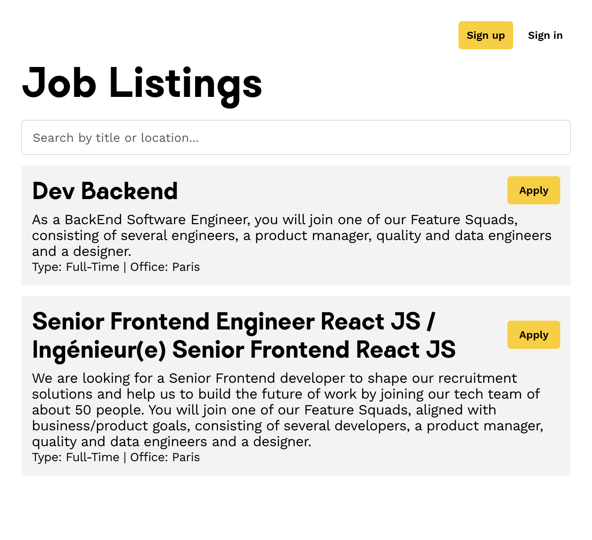
_Unauthenticated Job listings with search_

</td>
<td width="33%">

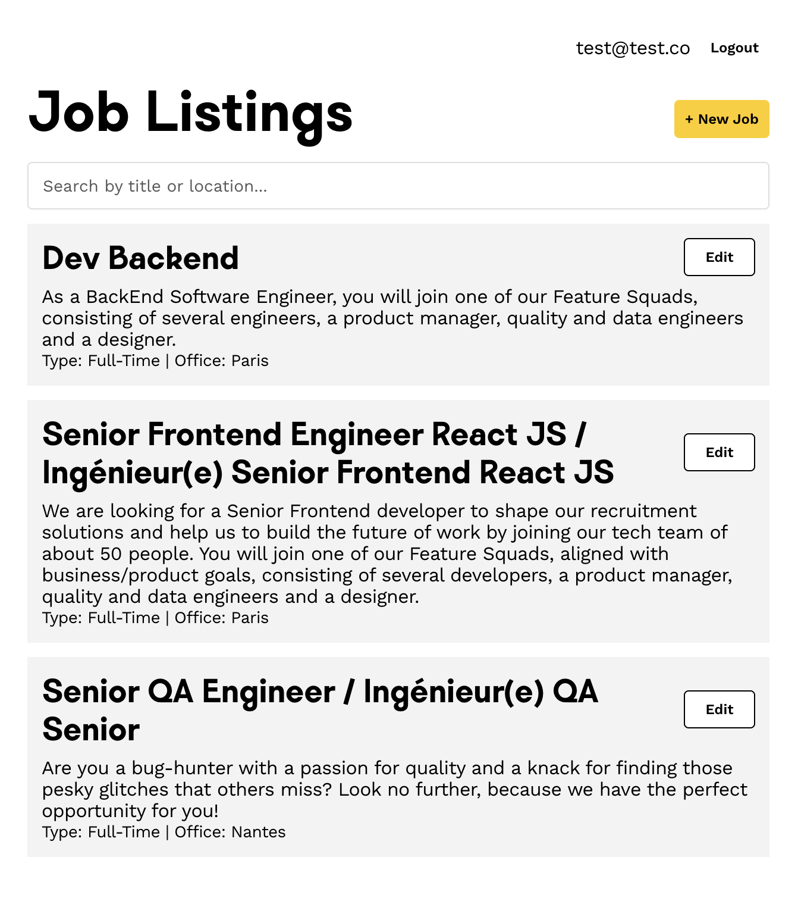
_Authenticated Job listings with search_

</td>
<td width="33%">

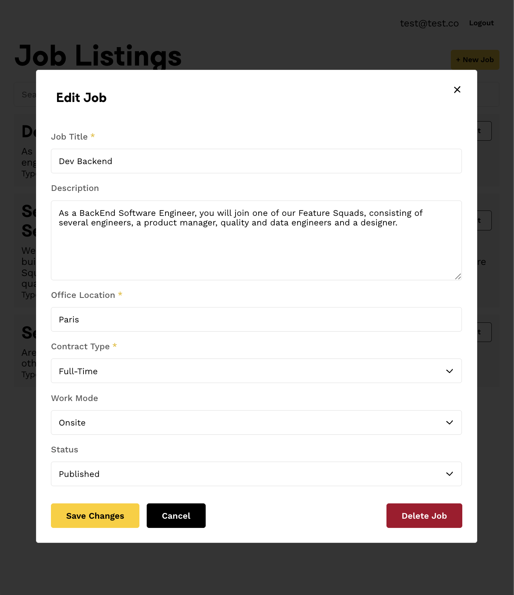
_Job editing with delete option_

</td>
</tr>
<tr>
<td width="33%">

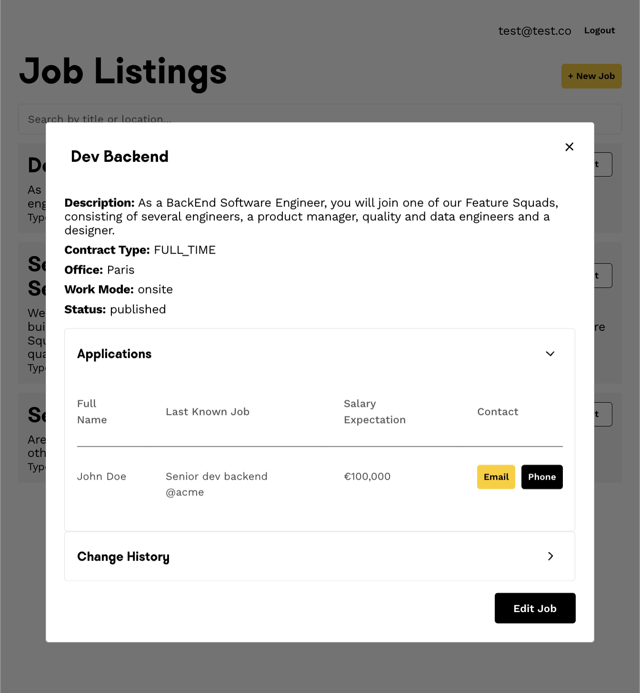
_View all applicants to specific job_

</td>
<td width="33%">

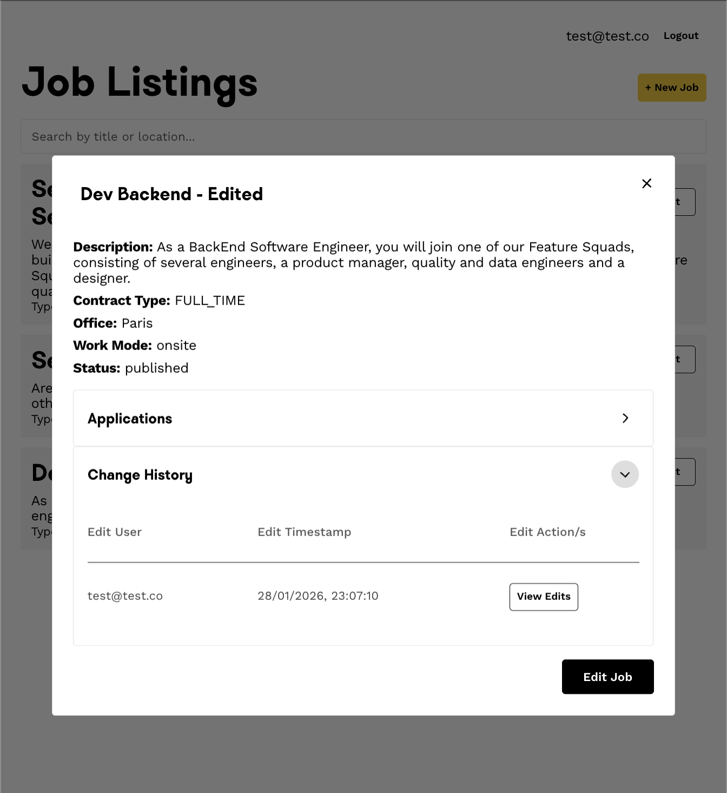
_View all specific job edits_

</td>
<td width="33%">

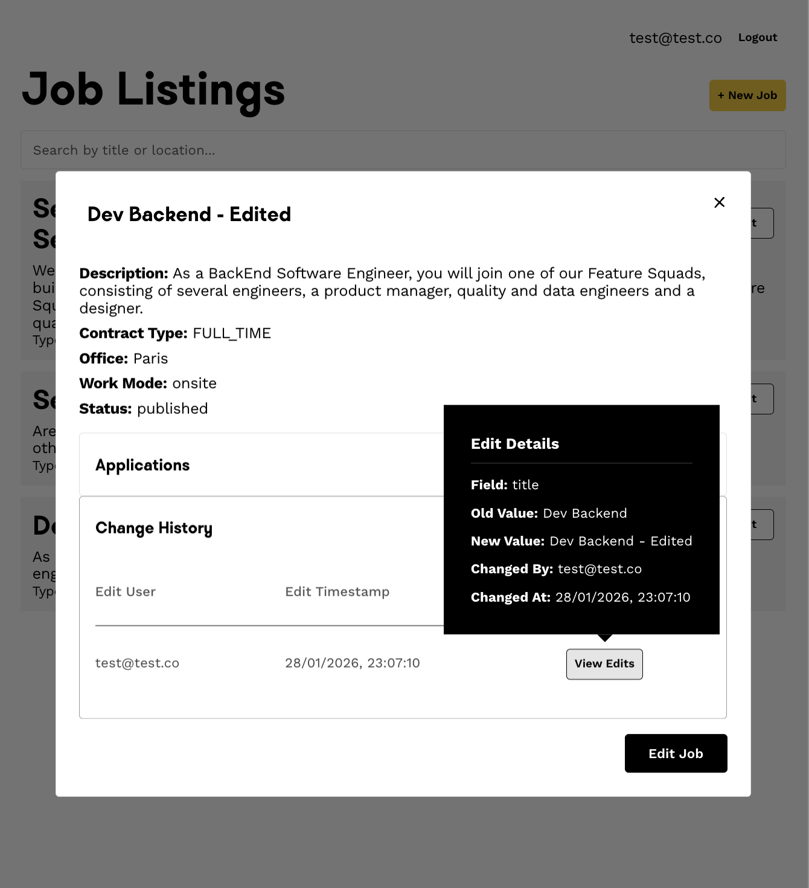
_Modification details popover_

</td>
</tr>
<tr>
<td width="33%">

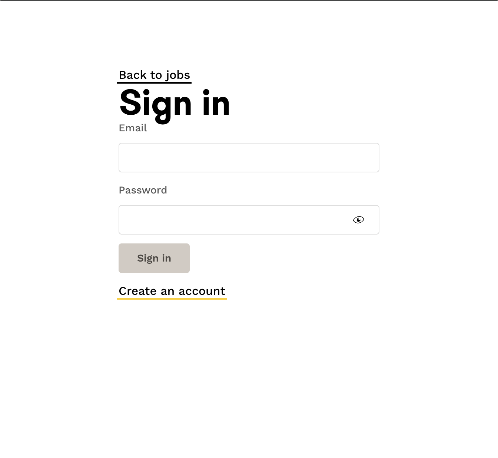
_Authentication flow, unchanged_

</td>
<td width="33%">

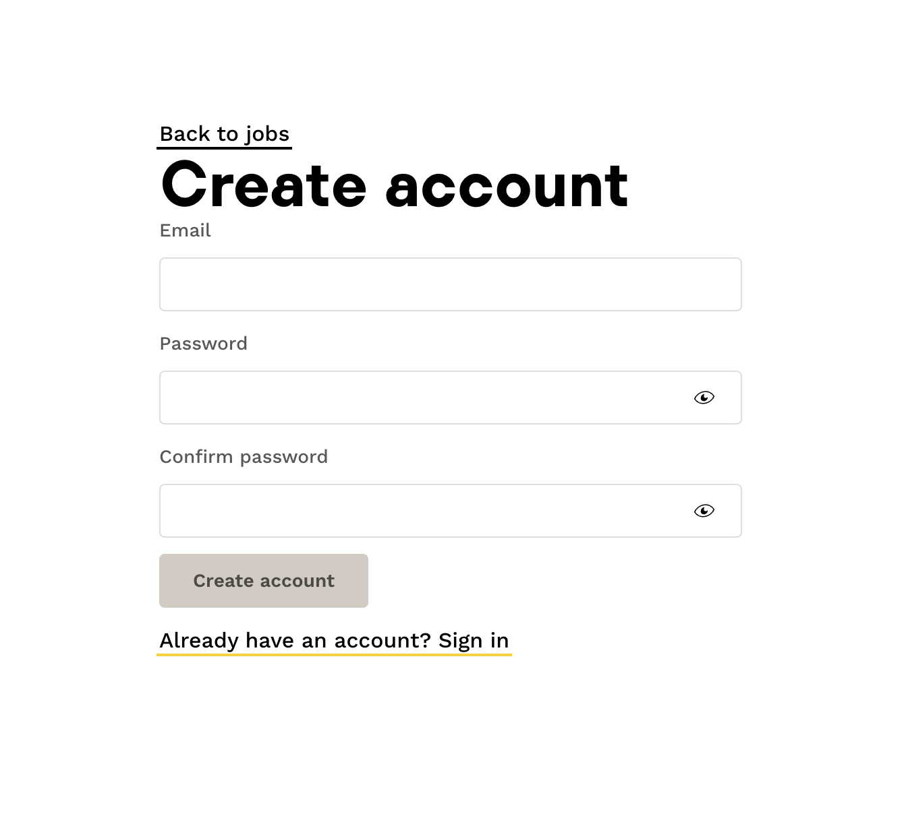
_User registration, unchanged_

</td>
<td width="33%">

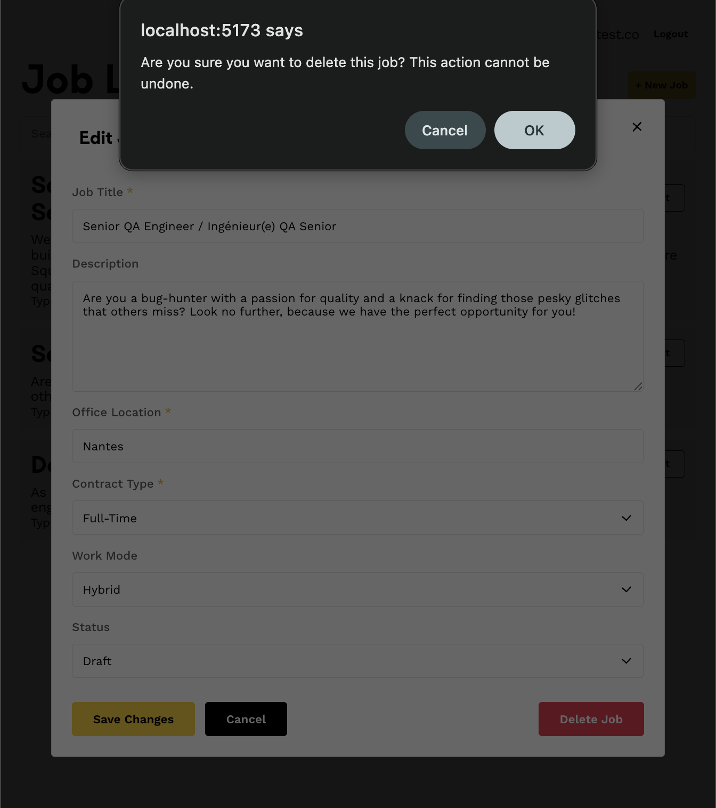
_Job deletion prompt, default confirm box_

</td>
</tr>
<tr>
<td width="33%">


_Email test unsuccessful on console, job has no owner (prepopulated jobs)_

</td>
<td width="33%">
</td>
<td width="33%">

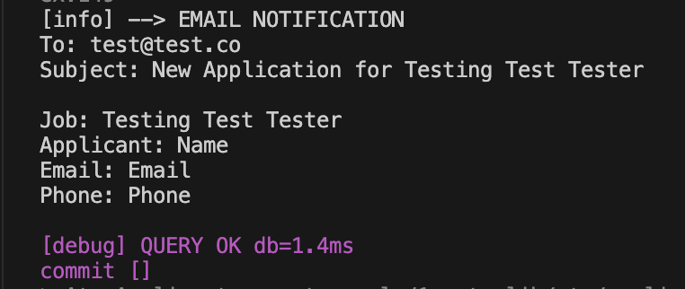
_Email test successful on console_

</td>

</tr>
</table>

---

## Design & Architecture Decisions

### Architecture

Rather than using separate pages, I implemented a **modal system** for all job interactions:

- Keeps users in context (no navigation away from job list)
- Provides smooth transitions with accordions for additional info
- Separates concerns: `JobModal` (wrapper) + specific modals for each action

### Component Reusability

- **JobModal**: Shared wrapper for all job-related modals (details/create/edit/apply)
- **Dynamic footerActions**: Prop-based button rendering for flexibility
- **Table components**: Reusable `ApplicationsTable` and `ModificationsTable`

### State Management

- **URL-driven modals**: Modal state tied to route (`/jobs/:id` opens detail modal)
- **Cookie-based auth**: Simple token storage for authentication state

---

## What I'd Add With More Time

- **Proper email service** (via integration)
- **Candidate accounts** for better duplicate prevention
- **File upload/s** for resumes/cover letters
- **Advanced search** with filters UI
- **Tags** for quick view of drafted/published
- **Pagination** for large job lists
- **Welcome-ui v10** for further component integration
- **E2E tests** with Playwright
- **Accessibility** (ARIA labels, keyboard navigation)

---

## Running the Project

### Backend

```bash
cd technical-test-fullstack-main
mix deps.get
mix ecto.setup

mix phx.server
```

### Frontend

```bash
cd frontend
yarn install

yarn dev
```

### Tests

```bash
# Backend
mix test

# Frontend
cd frontend
yarn test
```

---

## Conclusion

I honestly had a lot of fun working on this task, especially bringing my paper wireframe designs to life in the frontend.

Thank you so much for this opportunity; it was a great way to dive into a new stack while building something practical

:)
